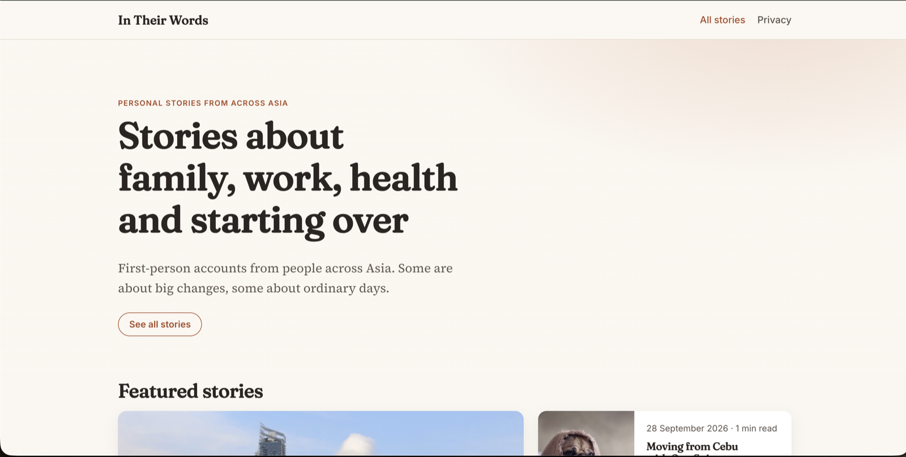
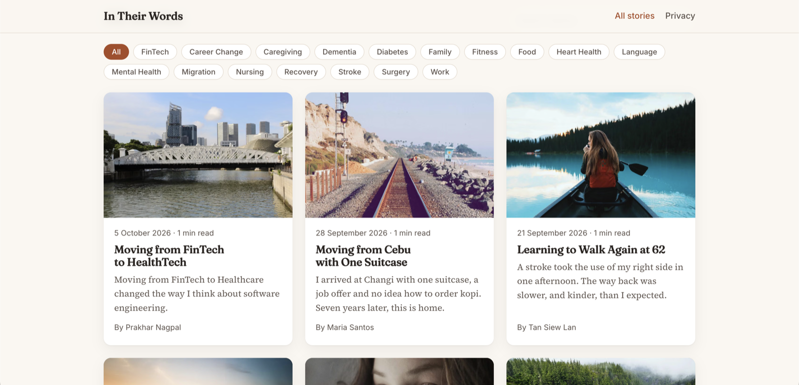
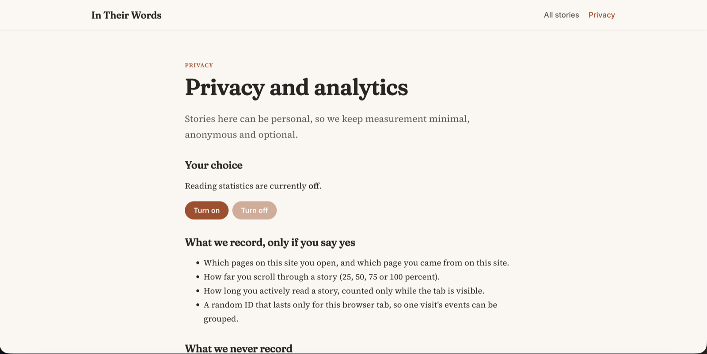
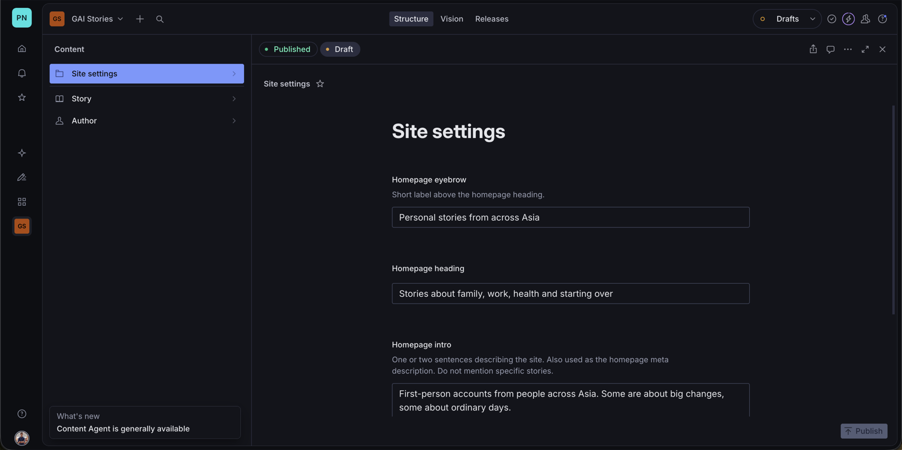
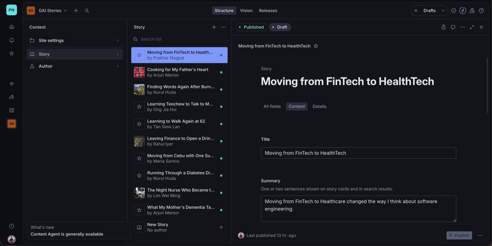
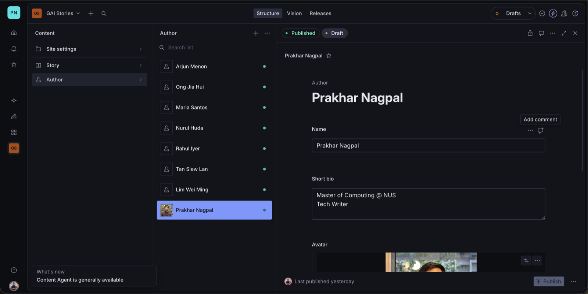

<div align="center">

# In Their Words

**Personal stories from across Asia.**

A small platform for first-person stories, built with Nuxt 4 and Sanity for the Global Asia Institute take-home.

[Live site](https://gai-stories.vercel.app) · [Source code](https://github.com/PrakharNagpal/GAI-STORIES)

</div>

---

## Screenshots

### Website

**Landing page**



**Featured stories**


**All stories, with topic filters**



**Privacy and analytics controls**



### Sanity Studio

**Site settings singleton** (edits the homepage hero text)



**Stories**



**Authors**



## Highlights

### Website

- **Welcoming landing page.** A featured section leads the page, with a fallback to the newest stories if nothing is featured, followed by every story in a responsive grid.
- **Search and topic filters.** Filter by text or topic, with a clear-filters shortcut and a live count for screen readers.
- **Made for reading.** A serif reading font, drop cap, reading progress bar, reading time, related stories, an author card and a share button (native share sheet on phones, copy link on desktop).
- **Fast images.** Responsive `srcset` sizes, automatic modern formats, blurred placeholders while loading, and a high priority hint on the main image.
- **Fast pages.** Self-hosted fonts, inlined critical CSS and CDN cache headers (`s-maxage=60, stale-while-revalidate=300`).
- **Search engine and sharing ready.** Open Graph and Twitter cards, JSON-LD, canonical URLs, and a generated sitemap and robots.txt.
- **Safe by default.** Security headers on every response.
- **Accessible.** Skip link, labelled controls, visible focus and image alt text.
- **Friendly errors.** A custom 404 and error page.
- **Privacy-first analytics.** Page views, scroll depth and active reading time, recorded only after explicit consent. Global Privacy Control and Do Not Track count as a no, events carry no personal data, and the server validates every event. Visitors can change their choice at any time on `/privacy`.
- **Code quality.** TypeScript, ESLint, Prettier, generated Sanity types and a GitHub Actions workflow.

### Sanity

- **Clear schemas with validation.** Required fields and length limits, field groups in the editor, and a newest-first ordering.
- **Rich text body.** Headings, quotes, links and inline images with captions.
- **Accessible images.** Alt text is required on story images, and hotspot cropping keeps the subject in frame.
- **Authors as their own documents.** Stories reference an author with a name, bio and avatar.
- **Tags and featured flag.** Editors choose what appears in the featured section and which topics a story belongs to.
- **Editable homepage.** A Site settings singleton holds the hero eyebrow, heading and intro. It is pinned to the top of the Studio, cannot be deleted or duplicated, and the site falls back to default text if it is empty.
- **Live content.** The site reads published documents straight from Sanity, so publishing a change updates the site without a deploy.
- **Seed script.** One command loads fictional sample authors, stories and settings.
- **Typed queries.** `sanity typegen` generates result types from the schema and the GROQ queries.

## Tech stack

| Area | Choice |
| --- | --- |
| Frontend | Nuxt 4, Vue 3, TypeScript, scoped CSS with design tokens |
| CMS | Sanity Studio with Portable Text |
| Data | GROQ queries, with result types generated by `sanity typegen` |
| Fonts | `@nuxt/fonts`: Fraunces, Source Serif 4 and Inter, self-hosted |
| Quality | ESLint, Prettier, `vue-tsc` and a GitHub Actions workflow |
| Hosting | Vercel |

## Project structure

```
studio/   Sanity Studio: schemas in schemaTypes/, seed script in scripts/make-seed.mjs
web/      Nuxt 4 app: pages and components in app/, API routes in server/
```

## Getting started

Requires Node 24 (see `.nvmrc`).

**1. Studio**

```bash
cd studio
npm install
npm run dev        # http://localhost:3333
```

**2. Seed sample content** (optional)

```bash
npm run seed       # replaces the whole production dataset with the sample content
```

**3. Web app**

```bash
cd web
cp .env.example .env     # add your Sanity project ID
npm install
npm run dev              # http://localhost:3000
```

To run a production build locally:

```bash
npm run build && node --env-file=.env .output/server/index.mjs
```

### Web scripts

| Script | What it does |
| --- | --- |
| `npm run lint` | Lint with ESLint |
| `npm run format` | Format with Prettier |
| `npm run typecheck` | Type check with `vue-tsc` |
| `npm run typegen` | Regenerate `app/types/sanity.generated.ts` from the schema and the queries in `app/utils/queries.ts`. Rerun after changing either. |

### Environment variables

| Variable | Purpose |
| --- | --- |
| `NUXT_PUBLIC_SANITY_PROJECT_ID` | Sanity project ID |
| `NUXT_PUBLIC_SANITY_DATASET` | Dataset name, usually `production` |
| `NUXT_PUBLIC_SITE_URL` | Canonical URL, sitemap and robots.txt host. On Vercel it falls back to the production domain. |

## Content model

| Type | Fields |
| --- | --- |
| `story` | title, slug, summary, featured image, author, published date, featured flag, tags, Portable Text body |
| `author` | name, bio, avatar |
| `siteSettings` | A singleton holding the homepage eyebrow, heading and intro |

All sample stories and people are fictional.

## Privacy (PDPA)

| Area | Detail | Risk |
| --- | --- | --- |
| Consent | Analytics only run after an explicit opt in, and Global Privacy Control or Do Not Track counts as a no. | Reading behaviour can reveal sensitive interests, for example which stories about health, family or religion someone reads |

See `/privacy` on the site for the visitor-facing explanation.

## AI declaration

I used Claude as a coding assistant, to help me understand concepts in Vue and Sanity, and for debugging. The architecture and design decisions are my own.
